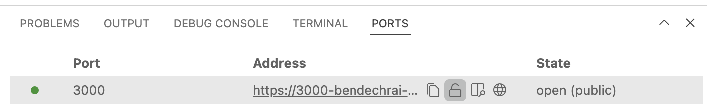

# Write Your Own Secure Messenger

This repo contains the guide and code for [Ben Dechrai][ben-twitter]'s workshop, "Write Your Own Secure Messenger".

## Step 1 - Setting Up

### Launch Gitpod

**👉 ACTION**: Click the following button to launch this code repository in Gitpod:

[](https://gitpod.io/#https://github.com/bendechrai/workshop-secure-messenger)

> GitPod is an in-the-cloud development environment that helps keep everyone in this workshop on the same environment, to minimise the likelihood of machine-specific issues in completing this course. They provide 50 hours of use per month for free, so if you already use GitPod on their free tier, please make sure you have at least 4 hours still available for this session.
>
> Alternatively, you can clone this repository to your local machine and work on it there. Please note that there might not be time to help support people with development environment setup issues, as support will be prioritised to attendees that are working on the course materials.

### Launch the App

Gitpod will build and start the web app, but in the event this doesn't happen, once Gitpod has loaded and you see the code editor in the browser window, open a terminal by pressing `ctrl-backtick` and run:

```bash
npm install
npm run dev
```

### Make the App Public

**👉 ACTION**: By default, Gitpod will lock your web app to only be accessible from the browser in which you're editing the code, but as we'll need to access the app from a different browser window later, make sure you make the website public by ensuring the padlock symbo is open on the "ports" tab.



**👉 ACTION**: Click on the link to `https://3000-...`

**🧪 CHECKPOINT**: You should be promted for a name to use in the chat, and once that's saved, you can enter messages in the chat.

### Done

You've reached the end of step 1 and should have a running chat-for-one working.

---

[▶️ STEP 2: Generating Keys](./STEP-2-GENERATING-KEYS.md)

_[🔙 Back to Repo](./README.md)_

[ben-twitter]: https://twitter.com/bendechrai
